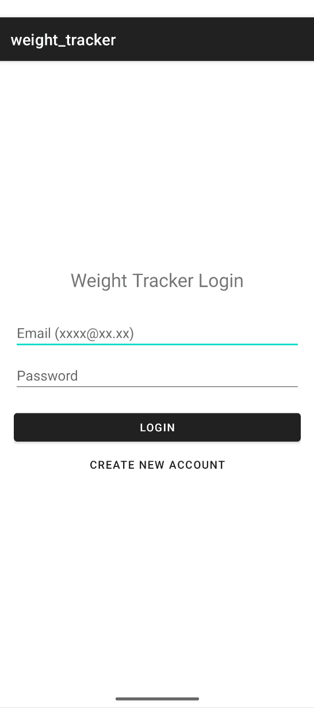

# Weight Tracker (Android Application)

## Description
This Android application, built using Kotlin, allows users to track their weight progress over time. The original version focused on basic UI and manual logging. The enhanced version introduces user authentication, persistent data storage, and automated notifications to improve user retention and data security.

## Enhancements
- **Software Design:** Improved UI/UX with Material Design components.
- **Security:** Integrated a secure login system for user data protection.
- **Functionality:** Added SMS notifications via `SmsManager` to alert users when reaching weight goals.

## Libraries & Technologies
- **Language:** Kotlin
- **Database:** Room Persistence Library (SQLite)
- **UI:** Material Components for Android
- **API:** AndroidX, SmsManager

## Installation & Setup
1. Clone this repository.
2. Open the project in **Android Studio (Ladybug or newer)**.
3. Ensure the `kotlin-kapt` plugin is enabled in your `build.gradle.kts`.
4. Sync the project with Gradle files.
5. Run the application on an emulator or physical device (API 24+).
